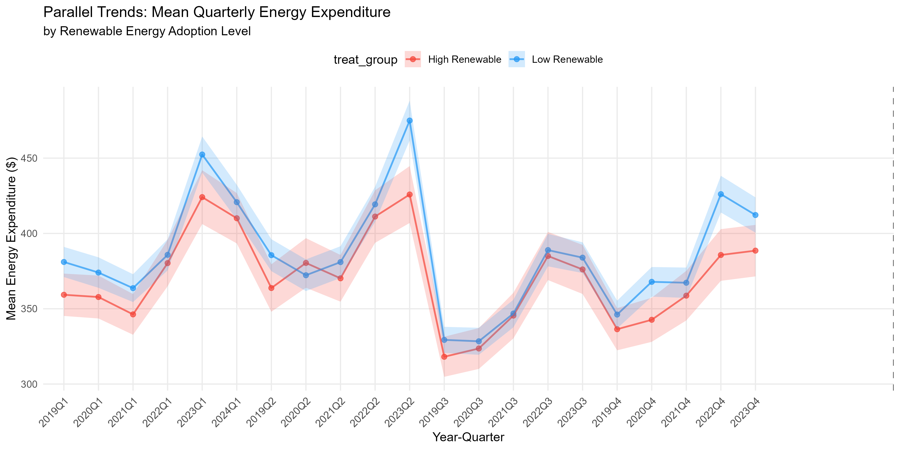

# Renewable Energy and the 2022 Energy Price Shock

**[View the rendered report online](https://juanariza-1.github.io/energy-policy-difference-in-differences/)**

An academic study of household energy expenditure across U.S. states with different renewable energy production intensities. The project uses Consumer Expenditure Survey microdata from **2019Q1 to 2024Q1** and difference-in-differences models with state and quarter fixed effects.

**Authors:** Juan Pablo Ariza Gallo and Juan Esteban Londoño  
**Institution:** Aix-Marseille University, Aix-Marseille School of Economics  
**Report date:** April 2026

## Read the project

The online view displays all 34 pages of the original paper without requiring a PDF plug-in. Both original PDFs remain available to open or download.

- [Paper: original root-level PDF export](reports/PAPER_DID.pdf)
- [Alternative final PDF export](reports/paper_energy_did_v2_final.pdf)
- [Saved figures](reports/figures/)
- [Reproducibility and version notes](docs/REPRODUCIBILITY.md)

Both PDFs and all saved figures are preserved as historical exports. The first PDF is featured because it was the paper stored at the original project root; the second is retained with its original filename. The available script versions are described separately below because their definitions do not exactly match every definition in the final paper.

The paper reports a statistically insignificant full-sample association and suggestive differences for high-income households. Its causal interpretation is qualified by the treatment proxy, potential weather confounding, and sample composition. These are reported findings from the saved paper, rather than newly estimated conclusions.



## Repository layout

```text
scripts/          Three historical R analysis versions and explicit setup/checks
data/processed/   Original analysis_dataset_v2.csv snapshot
data/raw/         Original renewable-energy workbook and raw-data retrieval notes
reports/          Two PDF exports and 15 saved figures
docs/             Version notes and checksums of unchanged artifacts
generated/        New outputs created locally when a script runs; ignored by Git
```

The included processed dataset has **88,006 observations, 38 columns, 41 states, and 21 quarters**. Its survey identifiers come from BLS public-use microdata and are retained for research joins. The much larger raw survey collection is retrieved separately; see [raw data instructions](data/raw/README.md).

## Run the historical processed-data analyses

Use R from the repository root. Install packages explicitly once:

```r
source("scripts/install_packages.R")
```

Then run:

```sh
Rscript scripts/check_inputs.R
Rscript scripts/FINAL_CODE.R
Rscript scripts/did_unified_analysis.R
```

The two processed-data scripts each estimate models and save 15 figures in separate folders under `generated/`. They use the included CSV without requiring a download. Run one or both to inspect the historical specifications. Set the `ENERGY_DID_ROOT` environment variable to the repository's absolute path when starting R from another folder.

To inspect the separate raw-data analysis, first obtain the FMLI files listed in [data/raw/fmli_manifest.csv](data/raw/fmli_manifest.csv), then run:

```sh
Rscript scripts/master_script.R
```

The master script constructs an analysis sample in memory and writes figures and an R workspace to `generated/master_script/`. It does not export `analysis_dataset_v2.csv`; it should not be treated as an exact reconstruction of that supplied snapshot.

## Data sources

Source: U.S. Bureau of Labor Statistics, [Consumer Expenditure Surveys public-use microdata](https://www.bls.gov/cex/pumd_data.htm), 2019-2024. Documentation: [Getting Started Guide](https://www.bls.gov/cex/pumd-getting-started-guide.htm). BLS publishes these data for public use; see its [copyright information](https://www.bls.gov/opub/copyright-information.htm).

The report attributes the renewable-energy measure to the U.S. Energy Information Administration's [State Energy Data System](https://www.eia.gov/state/seds/). The included workbook is the authors' original state-level summary, preserved unchanged. The precise source-series code and averaging years are not recorded in the workbook, so they remain a replication limitation. EIA describes reuse of its data in its [copyright and reuse policy](https://www.eia.gov/about/copyrights_reuse.php).

## Dependencies and validation

The scripts require `data.table`, `dplyr`, `tidyr`, `ggplot2`, `fixest`, `broom`, `stringr`, and `scales`. The optional raw-data version also uses `readxl`, `readr`, `haven`, and `modelsummary`. [Dependency setup](docs/DEPENDENCIES.md) explains the environment and validation scope.

No license is assigned to the authors' code or reports in this repository. The linked source agencies' terms apply to their data.

